# StatIQ — Интеллектуальный AI-хаб знаний БНС РК

**StatIQ** — это RAG-приложение (Retrieval-Augmented Generation), разработанное для автоматизации работы аналитиков и методологов Бюро национальной статистики Республики Казахстан. Система решает бизнес-задачи быстрого поиска информации в сложных внутренних регламентах, инструкциях, таблицах распределения прав доступа и спецификациях API метаданных системы META.

Информационная база парсится, векторизуется и сохраняется в специализированную базу данных, после чего пользователи могут взаимодействовать с базой знаний посредством естественного языка через кроссплатформенный интеллектуальный чат.

---

## 1. Архитектура Системы (System Architecture)

Система построена по RAG-архитектуре, дополненной эвристическими правилами маршрутизации и постобработкой ответов.

```mermaid
flowchart TD
    subgraph "Индексация (Ingestion Pipeline)"
        A[documents/] --> B[DocumentIndexer]
        B --> B1{Тип файла?}
        B1 -->|"roles.md"| B2["ROLES_SPLITTER\n(Chunk: 2500, Overlap: 200)"]
        B1 -->|"*.json (Swagger)"| B3["SwaggerSplitter\n(нарезка по эндпоинтам)"]
        B1 -->|"Инструкции .md"| B4["GUIDE_SPLITTER\n(Chunk: 1000, Overlap: 150)"]
        B1 -->|"Скриншоты"| B5["Парсинг изображений\n+ captions.properties"]
        B2 & B3 & B4 & B5 --> C[Модель эмбеддингов\nE5-small-v2]
        C -->|"Префикс passage:"| D[(PostgreSQL + pgvector)]
    end

    subgraph "Поиск и Ответ (Retrieval & Generation Pipeline)"
        E[Вопрос пользователя] --> F[RetrievalService]
        F --> F1{Эвристический фильтр\nключевых слов}
        F1 -->|"Роли/Права"| G["Принудительный подмес\nROLES.md"]
        F1 -->|"БДАП/Пакеты"| H["Принудительный подмес\nUSER_GUIDE_BDAP.md"]
        F1 -->|"Показатели/КСП"| I["Принудительный подмес\nUSER_GUIDE.md"]
        F1 -->|"Нет совпадений"| J[Векторный поиск в pgvector]
        
        J --> K{Ранжирование и Penalty}
        K -->|"Вопрос не про API"| K1[Штрафование сегментов Swagger\nсдвиг вниз]
        K -->|"Вопрос про API"| K2[Приоритет сегментов Swagger\nсдвиг вверх]
        
        G & H & I & K1 & K2 --> L[Формирование контекста]
        L --> M[PromptBuilder]
        M --> M1{Выбор режима mode}
        M1 -->|"user"| N[Инструкция методолога\nбез кода и API]
        M1 -->|"analyst"| O[Инструкция аналитика\nс API, JSON и схемами]
        
        N & O --> P[LLM Client\nGemini 2.5 Flash / Claude]
        P --> Q[MermaidPostProcessor\nисправление синтаксиса]
        Q --> R[Готовый ответ с источником\n+ Изображения]
    end
```



### RAG-пайплайн индексации документов
Процесс наполнения векторной базы данных реализуется в классе [DocumentIndexer.java](file:///c:/Users/hasen/AntigravityProjects/stat-knowledge-hub/src/main/java/kz/bns/hub/indexer/DocumentIndexer.java):
1. **Фильтрация документов**: Программа считывает файлы из папки `documents/`. На уровне кода поддерживаются только форматы `.pdf`, `.txt`, `.md`, `.pptx`. Файлы `.docx`, `.doc` и `.png` внутри подкаталога `documents/bdap/` автоматически **игнорируются** (закомментированы в массиве поддерживаемых расширений).
2. **Адаптивный чанкинг (Chunking)**: В зависимости от типа документа применяются специализированные сплиттеры:
   * **Таблицы ролей (`ROLES.md`)**: Используется крупный размер чанка (`chunk-size: 2500`, `chunk-overlap: 200`), чтобы сложные структуры прав доступа не разрывались.
   * **Документация и руководства (`USER_GUIDE.md`, `METHODOLOGY.md`, `USER_GUIDE_BDAP.md`)**: Используется средний размер чанка (`chunk-size: 1000`, `chunk-overlap: 150`).
   * **Swagger-файлы (JSON)**: Документы с описанием API (`meta-swagger.json`) обрабатываются с помощью кастомного [SwaggerSplitter.java](file:///c:/Users/hasen/AntigravityProjects/stat-knowledge-hub/src/main/java/kz/bns/hub/indexer/SwaggerSplitter.java). Он интеллектуально нарезает документ по границам конкретных эндпоинтов, предотвращая разделение путей запросов и их текстовых спецификаций. В качестве фолбэка используется мелкий сплиттер (`chunk-size: 500`, `chunk-overlap: 80`).
3. **Индексирование изображений (скриншотов)**:
   * В каталогах `documents/meta/images` и `documents/bdap/images` сканируются графические файлы.
   * Для каждого изображения извлекается подпись из файла `captions.properties` (или генерируется на основе имени файла).
   * Формируется текстовый сегмент с описанием скриншота и Markdown-разметкой ссылки на медиа-ресурс (например, ``), который затем векторизуется. При совпадении с запросом модель получает инструкцию встроить изображение дословно.
4. **Векторизация и Векторное хранилище**:
   * Для генерации эмбеддингов используется модель `e5-small-v2-q` (квантованная ONNX-модель в LangChain4j) с размерностью векторов **384**.
   * Сегменты индексируются с префиксом `passage: ` (требование семейства моделей E5 для документов).
   * Эмбеддинги сохраняются в базу данных PostgreSQL с расширением `pgvector`.
5. **Прогрев (Warm-up)**: При запуске приложения бэкенд выполняет один фиктивный вызов генерации эмбеддинга для предотвращения зависания ONNX-модели на первом запросе пользователя.

### Логика поиска и ранжирования (Retrieval Logic)
В классе [RetrievalService.java](file:///c:/Users/hasen/AntigravityProjects/stat-knowledge-hub/src/main/java/kz/bns/hub/service/RetrievalService.java) реализована гибридная логика выбора контекста:
1. **Приоритет эвристик**: Перед векторным поиском выполняется анализ текста запроса на наличие ключевых слов:
   * Вопросы о ролях, правах и разрешениях принудительно подмешивают полное содержимое файла `ROLES.md`.
   * Вопросы о БДАП, пакетах или загрузке принудительно подмешивают полное содержимое файла `USER_GUIDE_BDAP.md`.
   * Вопросы о показателях, КСП, добавлении форм принудительно подмешивают полное содержимое файла `USER_GUIDE.md`.
2. **Векторный поиск**: Запрос пользователя обогащается контекстом последних 2 сообщений из истории диалога и переводится в вектор с префиксом `query: `.
3. **Штрафование (Penalty) Swagger-сегментов**:
   * Если вопрос пользователя **не** содержит ключевых слов, указывающих на API (таких как `api`, `апи`, `эндпоинт`, `endpoint`, `swagger`, `url`, `json`), все сегменты, полученные из Swagger-документов, штрафуются при ранжировании и опускаются вниз выдачи, уступая место обычным инструкциям методологов.
   * Если вопрос классифицирован как API-запрос, сегменты Swagger поднимаются в приоритет.
4. **Keyword Fallback**: В случае если векторный поиск не вернул совпадений с оценкой выше `minScore` (по умолчанию `0.4`), система осуществляет классический полнотекстовый поиск по ключевым словам среди зарегистрированных сегментов.

### Ролевая модель ИИ и Формат Ответа
Динамическое переключение поведения модели реализовано в классе [PromptBuilder.java](file:///c:/Users/hasen/AntigravityProjects/stat-knowledge-hub/src/main/java/kz/bns/hub/ai/PromptBuilder.java):
* **Режим "Пользователь" (`user`)**: Инструкции ИИ требуют изъясняться простым языком, избегая технических деталей, кода и API-эндпоинтов. Ответ строится в виде понятных пошаговых руководств.
* **Режим "Аналитик" (`analyst`)**: ИИ ориентируется на технического специалиста. В промпт добавляется требование выводить спецификации API, таблицы параметров, JSON-структуры и использовать техническую терминологию.

**Постобработка ответа**:
* Полученный от LLM ответ проходит через [MermaidPostProcessor.java](file:///c:/Users/hasen/AntigravityProjects/stat-knowledge-hub/src/main/java/kz/bns/hub/ai/MermaidPostProcessor.java) для автоматического исправления синтаксических ошибок в блок-схемах Mermaid (проверка переносов строк, экранирование спецсимволов, латинские ID узлов).
* Ответ строго завершается ссылкой на файл-источник: `📎 Источник: [название файла]`.

---

## 2. Технологический Стек (Tech Stack)

| Компонент | Технология | Описание / Версия |
| :--- | :--- | :--- |
| **Бэкенд** | Java 21 / Spring Boot 3.2.5 | Основной каркас веб-приложения и REST API |
| | LangChain4j 0.36.2 | Фреймворк интеграции LLM и реализации RAG-пайплайна |
| | langchain4j-embeddings-e5-small-v2-q | Локальное встраивание эмбеддингов (ONNX-модель, квантованная) |
| | langchain4j-pgvector | Клиент векторного хранилища для PostgreSQL |
| | Apache Tika / POI-OOXML | Извлечение текста из офисных документов и PDF |
| | Lombok | Генерация бойлерплейт-кода |
| **Фронтенд** | Flutter (Dart SDK `>=3.0.0 <4.0.0`) | Кроссплатформенный клиент с адаптивным дизайном |
| | provider `^6.1.2` | Управление состоянием приложения (State Management) |
| | http `^1.2.1` | Взаимодействие с API бэкенда |
| | flutter_markdown `^0.7.3` | Рендеринг ответов ИИ с поддержкой таблиц и списков |
| | shimmer `^3.0.0` | Визуальный эффект ожидания ответа (Skeleton Loader) |
| **Данные** | PostgreSQL 16 + pgvector | Реляционная СУБД с поддержкой векторных операций поиска |
| **Модели ИИ** | Google Gemini 2.5 Flash / Claude | Внешние языковые модели генерации текста (LLM) |

---

## 3. Структура Репозитория (Project Structure)

```
stat-knowledge-hub/
├── .agents/                            # Конфигурации и workflows агентов
├── documents/                          # База знаний системы (документы для индексации)
│   ├── bdap/                           # Документация по БДАП
│   │   ├── USER_GUIDE_BDAP.md          # Руководство пользователя БДАП
│   │   └── images/                     # Скриншоты интерфейсов БДАП
│   └── meta/                           # Документация по метаданным
│       ├── METHODOLOGY.md              # Методология ведения показателей
│       ├── ROLES.md                    # Спецификация прав доступа и ролей
│       ├── USER_GUIDE.md               # Руководство пользователя КСП
│       ├── meta-swagger.json           # OpenAPI/Swagger спецификация API META
│       └── images/                     # Скриншоты интерфейсов META
├── pom.xml                             # Конфигурация Maven зависимостей бэкенда
├── docker-compose.yml                  # Оркестрация локальной базы данных pgvector
├── .gitignore                          # Правила исключения временных файлов и конфигов из Git
├── src/                                # Исходный код Java бэкенда
│   └── main/
│       ├── java/kz/bns/hub/
│       │   ├── StatKnowledgeHubApplication.java # Точка входа Spring Boot
│       │   ├── ai/
│       │   │   ├── AiConfig.java       # Инициализация клиентов ИИ и эмбеддинг-моделей
│       │   │   ├── LlmClient.java      # Общий интерфейс взаимодействия с LLM
│       │   │   ├── GeminiClient.java   # Реализация вызовов Google Gemini API
│       │   │   ├── ClaudeClient.java   # Реализация вызовов Claude API (legacy/deprecated)
│       │   │   ├── PromptBuilder.java  # Построение системных и пользовательских промптов
│       │   │   ├── MermaidPostProcessor.java # Исправление ошибок синтаксиса Mermaid
│       │   │   └── ImagePostProcessor.java   # Инъекция скриншотов в ответы
│       │   ├── config/
│       │   │   ├── VectorStoreConfiguration.java # Настройка pgvector EmbeddingStore
│       │   │   └── WebConfig.java       # Настройка CORS и фильтров безопасности
│       │   ├── controller/
│       │   │   └── ChatController.java # Эндпоинты /api/chat, /api/status, /api/health
│       │   ├── indexer/
│       │   │   ├── DocumentIndexer.java # Парсинг документов и наполнение pgvector
│       │   │   └── SwaggerSplitter.java # Нарезка спецификации JSON по эндпоинтам
│       │   └── service/
│       │       ├── DocumentStatsService.java # Учет количества загруженных сегментов
│       │       ├── RetrievalService.java     # Поиск релевантного контекста (вектор + эвристики)
│       │       └── SegmentRegistry.java      # Локальный кэш сегментов для keyword поиска
│       └── resources/
│           ├── application.properties.origin # Шаблон конфигурации бэкенда
│           └── application.properties        # Локальный конфиг с секретами (в gitignore)
└── statiq_flutter/                     # Исходный код кроссплатформенного фронтенда
    ├── pubspec.yaml                    # Зависимости Flutter-приложения
    ├── web/                            # Конфигурации для веб-сборки
    └── lib/                            # Код приложения на Dart
        ├── main.dart                   # Инициализация и запуск приложения
        ├── models/                     # Модели данных (сообщения чата, сессии)
        ├── providers/                  # Управление стейтом чата (ChatProvider)
        ├── screens/                    # Экраны интерфейса (ChatScreen)
        └── services/                   # Сервисы взаимодействия с API бэкенда
```

---

## 4. Быстрый Старт для Разработчика (Quick Start)

### Шаг 1: Запуск Инфраструктуры
Для хранения векторов требуется PostgreSQL с расширением `pgvector`. В корне проекта подготовлен конфигурационный файл `docker-compose.yml`:

```yaml
services:
  db:
    image: pgvector/pgvector:pg16
    container_name: statiq_db
    environment:
      POSTGRES_USER: statiq_user
      POSTGRES_PASSWORD: statiq_password
      POSTGRES_DB: statiq_db
    ports:
      - "5432:5432"
    volumes:
      - pgvector-data:/var/lib/postgresql/data
    restart: always

volumes:
  pgvector-data:
```

Запустите контейнер в фоновом режиме:
```bash
docker compose up -d
```

### Шаг 2: Конфигурация Бэкенда
Скопируйте шаблон конфигурации в рабочий файл настроек:
```bash
cp src/main/resources/application.properties.origin src/main/resources/application.properties
```

Откройте созданный файл `application.properties` и заполните параметры.

<details>
<summary><b>Описание параметров конфигурации</b></summary>

```properties
# Выбор AI-провайдера (gemini / claude)
ai.provider=gemini
# API ключ для доступа к Google Gemini API
ai.gemini.api-key=YOUR_API_KEY
ai.gemini.model=gemini-2.5-flash

# Настройки RAG-индексации
app.docs.path=./documents
app.index.chunk-size=1200
app.index.chunk-overlap=200
app.index.passage-prefix=passage:

# Настройки поиска контекста
app.search.max-results=10
app.search.candidates=30
app.search.min-score=0.4
app.search.query-prefix=query:

# Настройки подключения к СУБД pgvector
spring.datasource.url=jdbc:postgresql://localhost:5432/statiq_db
spring.datasource.username=statiq_user
spring.datasource.password=statiq_password
spring.datasource.driver-class-name=org.postgresql.Driver

# Настройки таблицы векторов
app.vector-store.table-name=statiq_embeddings
app.vector-store.dimension=384
app.vector-store.create-table=true
app.vector-store.drop-table-first=false
```
</details>

### Шаг 3: Сборка и Запуск Бэкенда
Соберите проект и запустите Spring Boot приложение с помощью Maven:
```bash
mvn clean compile
mvn spring-boot:run
```
При старте система автоматически:
1. Подключится к СУБД и при необходимости создаст таблицу векторов `statiq_embeddings`.
2. Сканирует папку `documents/`, отфильтрует поддерживаемые документы и разобьет их на чанки.
3. Прогреет ONNX-модель генерации эмбеддингов.
4. Выведет в лог готовность: `Готово! Документов: X, скриншотов: Y, фрагментов: Z`.

**Проверка работоспособности**:
* Health check: `GET http://localhost:8090/api/health` -> Должен вернуть `OK`.
* Статус индексов: `GET http://localhost:8090/api/status` -> Вернет JSON вида:
  ```json
  {"status":"ready","documentsLoaded":12,"segmentsIndexed":640}
  ```

### Шаг 4: Запуск Фронтенда (Flutter-клиент)
Перейдите в директорию клиента и запустите приложение:
```bash
cd statiq_flutter
flutter pub get
flutter run
```
*Для запуска веб-версии используйте:* `flutter run -d chrome`.

---

## 5. Интеграционное API (REST API)

### Отправка сообщения в чат
* **Эндпоинт**: `POST /api/chat`
* **Content-Type**: `application/json`

**Пример тела запроса (Аналитик с историей):**
```json
{
  "question": "Как получить список показателей через API?",
  "mode": "analyst",
  "messages": [
    {
      "role": "user",
      "content": "Привет, помоги мне с системой МЕТА"
    },
    {
      "role": "assistant",
      "content": "Привет! Я готов подсказать информацию по системе МЕТА. Какая спецификация вас интересует?"
    }
  ]
}
```

**Пример ответа бэкенда:**
```json
{
  "answer": "📄 **Из документов БНС:**\nДля получения перечня показателей используйте метод GET `/meta/indicator`.\n\nПример запроса:\n```http\nGET /meta/indicator?page=0&size=20\n```\n\n📎 **Источник:** [meta-swagger.json]"
}
```

---

## 6. Правила Безопасности (Security Guardrails)

> [!CAUTION]
> **Конфиденциальность API-ключей и учетных данных**
> 
> Ни при каких обстоятельствах не добавляйте файл `application.properties`, содержащий реальные API-ключи провайдеров (Gemini, Claude) или пароли от СУБД, в индекс системы контроля версий Git. 
> 
> В репозитории настроен `.gitignore`, который блокирует случайную отправку `/src/main/resources/application.properties` на удаленный сервер. 
> В коммиты разрешается вносить изменения только в шаблонный файл `application.properties.origin`.

Если вы обнаружили, что API-ключ попал в коммит истории Git, немедленно **отозовите ключ** в консоли провайдера ИИ (Google AI Studio / Anthropic Console) и сгенерируйте новый.
